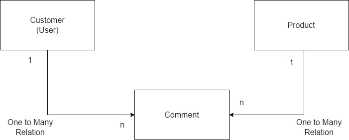

# Spring Boot Market API

### Properties

---

* Get Product Comments By Id 
* Get Product Comment By Date Range
* Get Customer Comments
* Get Customer Comments By Date Range
* Get Expired Products
* Get Not Expired Products

[Postman Collection for Test => Import to Postman](MarketAPI.postman_collection.json "download")

### Models

---

 

### Tech Stack

----

* Java 17
* Spring Boot 2.7.3
* Spring Data JPA
* H2 Database

